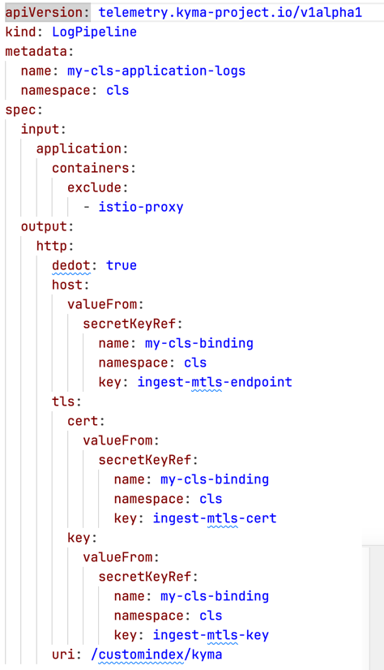

# Overview

Welcome to the first sample in our three-part series, where we will explore how Kyma can seamlessly integrate with the SAP Cloud Logging service. By enabling the three pillars of observability - logs, traces, and metrics - Kyma developers and operators can effectively troubleshoot issues, identify root causes, investigate performance bottlenecks, and gain a comprehensive understanding of system behavior.

In this sample, we will delve into the following topics:

1. SAP Cloud Logging: An Overview
   - Learn about the SAP Cloud Logging service and its significance in the context of Kyma integration.
   - Discover how to provision an instance of SAP Cloud Logging.

2. Shipping Logs to SAP Cloud Logging
   - Explore the step-by-step process of shipping logs from applications deployed on SAP BTP, Kyma runtime to SAP Cloud Logging.

In the subsequent samples, we will continue our exploration by discussing the integration of traces and metrics.

## What is SAP Cloud Logging?

The SAP Discovery Center description says:

*SAP Cloud Logging service is an instance-based observability service that builds upon OpenSearch to store, visualize, and analyze application logs, metrics, and traces from SAP BTP Cloud Foundry, Kyma, Kubernetes, and other runtime environments.

For Cloud Foundry and Kyma, SAP Cloud Logging offers an easy integration by providing predefined content to investigate the load, latency, and error rates of the observed applications based on their requests and correlate them with additional data.*

To get started with SAP Cloud Logging, visit the [Discovery Center](https://discovery-center.cloud.sap/serviceCatalog/cloud-logging?service_plan=overall-(large,-standard,-and-dev)&region=all&commercialModel=cloud&tab=feature) where you will find more detailed information about its features and capabilities.

Pricing for the SAP Cloud Logging service can be determined using the [SAP Cloud Logging Capacity Unit Estimator](https://sap-cloud-logging-estimator.cfapps.us10.hana.ondemand.com/). It is important to note that for Kyma, the "Ingest Otel" option needs to be enabled, which should be taken into account when estimating pricing. This option is used for shipping traces and metrics.

## Provision an Instance of SAP Cloud Logging

Now, let's explore how we can leverage SAP Cloud Logging to ingest logs from applications deployed on SAP BTP, Kyma runtime.

### Prerequisites

- [SAP BTP, Kyma runtime instance](../prerequisites#kyma)
- [Kubernetes tooling](../prerequisites#kubernetes)
- Entitlement added for SAP Cloud Logging to the subaccount where Kyma is provisioned

### Procedure

You can refer to the [official SAP documentation](https://help.sap.com/docs/cloud-logging/cloud-logging/create-sap-cloud-logging-instance-through-sap-btp-service-operator?version=Cloud) to create an SAP Cloud Logging service instance for details.

- Export your namespace's name as an environment variable.

```shell
export NS={your-namespace}
```

- To provision an instance of SAP Cloud Logging, create an instance of SAP Cloud Logging and a service binding:

```shell
kubectl -n ${NS} apply -f ./k8s/cls-instance.yaml
```

For reference, this is the service instance specification:

```yaml
apiVersion: services.cloud.sap.com/v1
kind: ServiceInstance
metadata:
    name: my-cls
spec:
    serviceOfferingName: cloud-logging
    servicePlanName: dev
    parameters:
      retentionPeriod: 7
      esApiEnabled: false
      ingest_otlp:
        enabled: true
```

This is the corresponding service binding.

```yaml
apiVersion: services.cloud.sap.com/v1
kind: ServiceBinding
metadata:
    name: my-cls-binding
spec:
  serviceInstanceName: my-cls
  credentialsRotationPolicy:
    enabled: true
    rotationFrequency: "720h"
    rotatedBindingTTL: "24h"
```

The service binding specifies the credentials rotation policy. It is a great developer experience that the Telemetry module intelligently switches to new credentials once they are rotated. This does not require any action from the developer.

> **NOTE:** The same instance will be reused for configuring tracing and monitoring.

The service binding also generates a Secret with the same name. It contains the details to access the dashboard of the SAP Cloud Logging instance previously created.


## Ship your application logs to SAP Cloud Logging

To ship your logs to SAP Cloud Logging, create LogPipeline custom resources (CRs).

Your application running in SAP BTP, Kyma runtime will send logs to stdout. The Telemetry module based on the LogPipeline will capture and ship them to SAP Cloud Logging.

### Create a LogPipeline CR for Your Application Logs

To create the LogPipeline, run:

```shell
kubectl apply -f ./k8s/logging/logs-pipeline-application-logs.yaml
```

In the LogPipeline, configure the details about shipping the logs to SAP Cloud Logging. Include major configurations such as:

- Input: From which applications, containers, and namespaces the logs should be shipped
- Output: The access details of the SAP Cloud Logging instance to which logs will be shipped

You can learn about all the parameters in detail from the official Telemetry [LogPipeline](https://kyma-project.io/#/telemetry-manager/user/resources/02-logpipeline?id=custom-resource-parameters) documentation.

This is an example of the LogPipeline configuration used for this sample:



### Create a LogPipeline CR for the Istio access logs

Referred from [kyma-project.io documentation about istio access logs](https://kyma-project.io/#/istio/user/operation-guides/02-30-enable-istio-access-logs?id=enable-istio-access-logs).

Istio access logs provide fine-grained details about the traffic when accessing the workloads that are part of Istio service mesh. The only prerequisite is to enable Istio sidecar injection for your workloads. The Istio access logs provide useful information relating to 4 golden signals, such as latency, traffic, errors, and saturation as well as any troubleshooting anomalies.

To create the LogPipeline, run:

```shell
kubectl apply -f ./k8s/logging/logs-pipeline-istio-access-logs.yaml
```

This is an example of the LogPipeline configuration used for this sample:


## View the logs

You can access the SAP Cloud Logging instance dashboard. The access details are available in the Secret generated by the service binding.


The simplest way to start exploring the logs is to navigate to **Discover** and choose the appropriate index.


You can choose the index pattern to view the relevant logs, apply a filter or search term to narrow down your search or use other Open Search capabilities.


We will talk more about metrics in one of the next samples. However, I would like to bring your attention to the Four Golden Signals dashboard. It is provided out of the box and is based on the Istio access logs which we configured previously.

For reference, check out the generic and latency dashboards.


Now you can start exploring your application as well as the access logs.

Stay tuned for the next samples about shipping traces from SAP BTP, Kyma runtime to SAP Cloud Logging.
